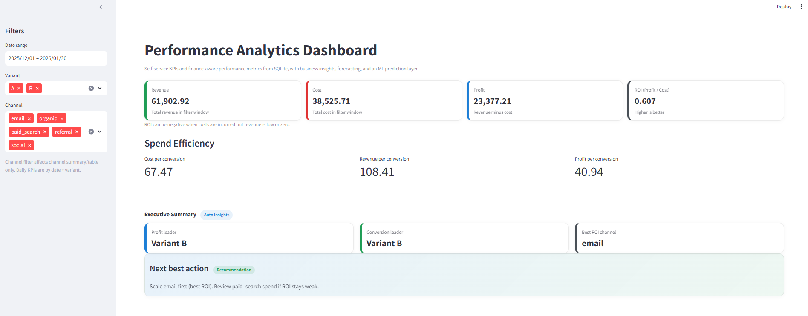
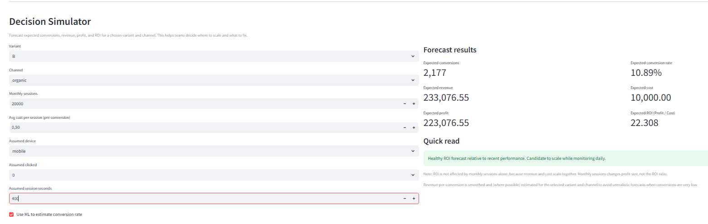
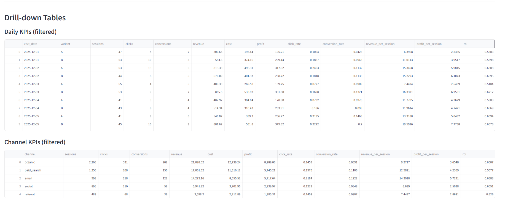
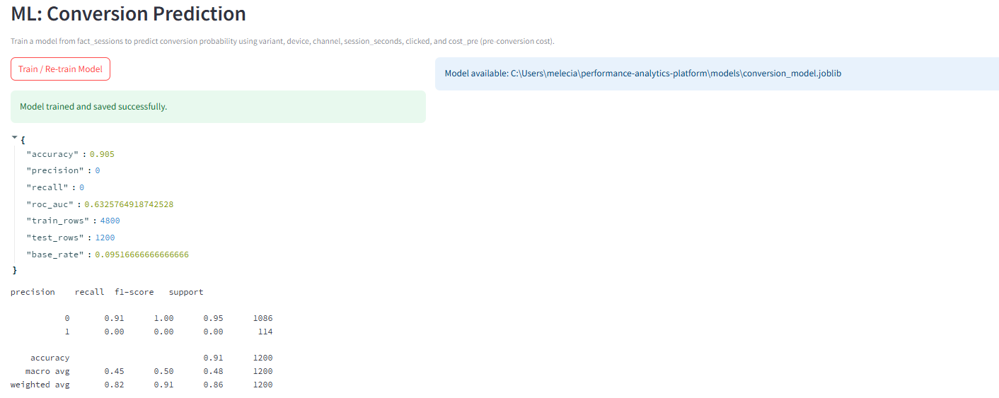
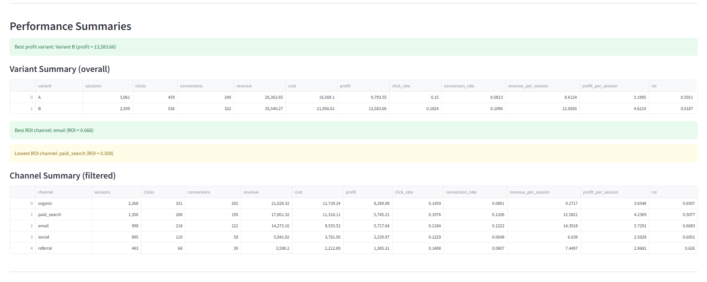
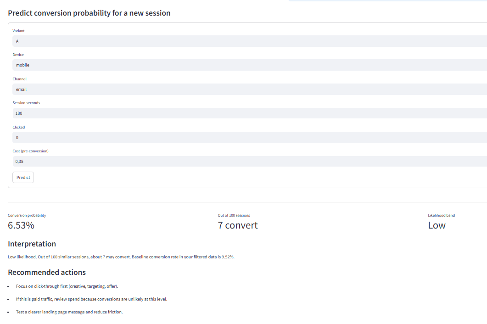
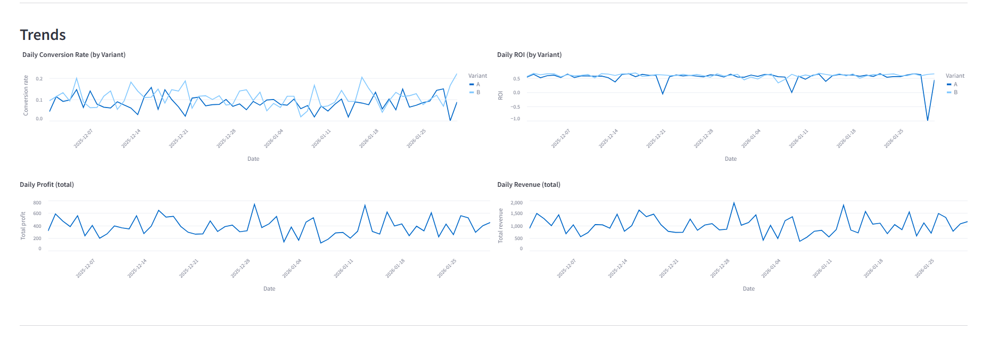

## Overview

The Performance Analytics Platform is a lightweight analytics system that demonstrates how raw marketing data can be transformed into business insights.

The platform simulates user session data, processes it through an ETL pipeline, builds analytical data models, and exposes performance metrics through an interactive dashboard.

It supports experiment analysis, marketing performance monitoring, machine learning conversion prediction, and scenario simulation for decision making.

---

## Key Features

### End-to-End Data Pipeline

Raw event data is generated and processed through ingestion, transformation, validation, and analytics layers.

### Finance-Aware Performance Metrics

The platform calculates key business metrics including:

- Revenue
- Cost
- Profit
- ROI
- Cost per conversion
- Revenue per conversion
- Profit per conversion

### A/B Experiment Analysis
Evaluate marketing experiments and compare conversion performance between variants.

### Machine Learning Conversion Prediction
A trained model predicts the probability that a session will convert based on traffic source, engagement, and marketing attributes.

### Decision Simulator
Forecast expected conversions, revenue, profit, and ROI under different marketing scenarios.

### Interactive Analytics Dashboard
A Streamlit dashboard enables exploration of performance metrics, experiment results, trends, and predictions.

---

## Tech Stack

- Python
- Pandas
- NumPy
- SQLite
- SQL
- Matplotlib
- Streamlit
- Scikit-learn

---

## Project Structure

```
performance-analytics-platform/

data/
  raw/                # synthetic marketing event data
  processed/          # SQLite analytics database
  outputs/            # reports and charts

src/
  ingest.py           # synthetic data generation
  load.py             # load raw data into SQLite
  transform.py        # build analytics tables
  quality_checks.py   # data validation checks
  analytics.py        # KPI outputs and analysis
  ml_conversion.py    # ML conversion prediction model
  main.py             # pipeline orchestration

sql/
  schema.sql          # database schema
  views.sql           # analytics views

models/
  conversion_model.joblib

app.py                # Streamlit analytics dashboard
```

---

## Data Pipeline Workflow

The system processes data through the following stages.

### Data Ingestion

Synthetic marketing session data is generated to simulate traffic sources, user behaviour, and conversions.

### Data Loading

Raw event data is loaded into an SQLite analytical database.

### Data Transformation

Data is transformed into analytical tables and KPI views used for reporting.

### Data Quality Checks

Validation checks confirm required fields and metrics exist before analytics processing.

### Analytics Layer

Aggregated KPI datasets are created for reporting and dashboard use.

### Machine Learning

A classification model predicts the probability that a session converts.

### Dashboard

Performance metrics, trends, predictions, and forecasts are displayed in an interactive dashboard.

---

## Data Model

The analytics schema includes the following core tables.

### raw_visits
Raw synthetic event data.

### dim_user
User dimension table.

### fact_sessions
Session-level metrics including channel, device, engagement, marketing cost, and conversion outcome.

### mart_daily_kpis
Aggregated daily performance metrics used for reporting and dashboards.

---

## Running the Platform

### Run the full pipeline

```
python -m src.main
```

This step:

- generates synthetic event data
- loads the SQLite database
- builds analytics tables
- runs validation checks
- produces KPI outputs

### Launch the dashboard

```
streamlit run app.py
```

The dashboard allows users to explore:

- marketing performance KPIs
- channel and variant comparisons
- experiment results
- conversion probability predictions
- scenario forecasting

---

## Generated Outputs

### SQLite Database
```
data/processed/analytics.db
```

### KPI Datasets
- daily_kpis.csv
- channel_kpis.csv
- variant_kpis.csv
- ab_test_summary.csv

### Charts
- conversion trends
- ROI trends
- revenue by channel
- profit by channel

---

## Example Insights

Typical insights generated by the platform include:

- Variant B produces higher conversion rates and profit than Variant A
- Email campaigns generate the highest ROI relative to cost
- Paid search drives higher traffic volume but lower profitability
- Conversion probability increases with engagement signals such as session duration and clicks

---

## Architecture

```
Raw Data (CSV)
        │
        ▼
Python ETL Pipeline
(ingest → transform → load)
        │
        ▼
SQLite Analytics Database
(dim_user, fact_sessions, mart_daily_kpis)
        │
        ▼
Analytics Layer (SQL Views)
        │
        ▼
Streamlit Dashboard
ML Conversion Prediction
Decision Simulator
```

---

## Dashboard Preview

### Performance Overview


Displays the main analytics dashboard including revenue, cost, profit, ROI, spend efficiency metrics, and automated executive insights.

---

### Decision Simulator


Allows users to forecast conversions, revenue, profit, and ROI by adjusting traffic scenarios and marketing inputs.

---

### KPI Drill-down Tables


Interactive data tables enable deeper inspection of daily performance metrics and channel-level KPIs.

---

### Model Training Results


Displays machine learning model training metrics including accuracy, ROC AUC, and classification performance.

---

### Performance Summaries


Automatically highlights the best performing variants and marketing channels based on profitability and ROI.

---

### Conversion Probability Prediction


Allows users to estimate the probability that a session converts using device, channel, engagement signals, and marketing cost.

---

### Performance Trends


Trend visualizations track conversion rates, ROI, revenue, and profit over time.

## Project Summary

Performance Analytics Platform

Designed and implemented an analytics pipeline that converts raw marketing event data into business performance insights.

Key components include:

- ETL pipeline for marketing session data
- Analytics data models and KPI tables
- Experiment performance analysis
- Machine learning conversion prediction
- Interactive dashboard for KPI exploration and forecasting
